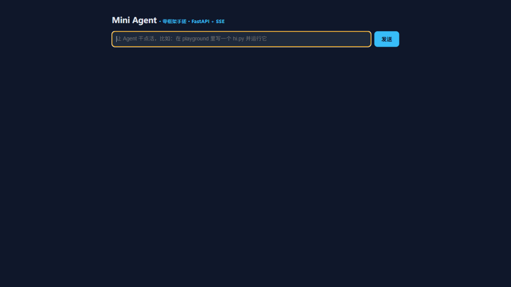
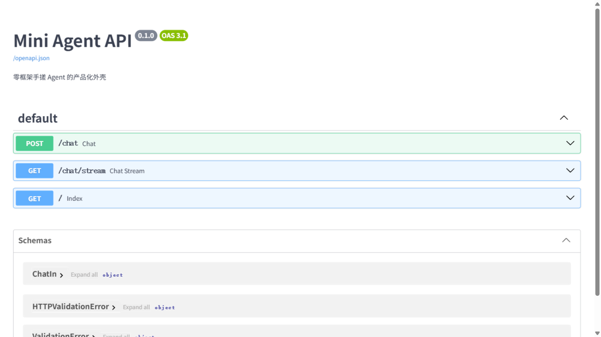

<div align="center">

# Mini Agent

**零框架从零手搓的 LLM Agent —— 从第一次 LLM 调用到完整产品化 Runtime 的 26 个渐进模块**

*A from-scratch LLM Agent in 26 progressive modules — no agent framework, only the official OpenAI client.*

[简体中文](README.md) | [English](README_EN.md)




</div>

---

## 为什么从零手搓

框架（LangChain / LlamaIndex…）把决策藏了起来：**用它们的人知道怎么调，手写过的人知道为什么。**
本项目从 `hello LLM` 开始，把 Agent 的每一个零件亲手造一遍——循环、工具、记忆、压缩、重试、
多智能体、权限、注册表——最后补上产品化三件套（RAG / MCP / 流式 API），总装成一个能部署的完整 Agent。

```text
Mini Agent Runtime
├── 大脑层：LLM 调用 + 三段式退避重试（step1 / step14）
├── 决策循环：while + finish_reason 红绿灯 + max_steps 保险丝（step3 / step5）
├── 工具层：读写追加终端六只手 + 注册表分发 + 未知工具优雅拒绝（step2~8 / step22）
├── 安全层：白名单 + SAFE/ASK/AUTO 三模式 + 链式注入拦截（step23 / step26）
├── 记忆层：memory.txt 跨会话记忆 + 上下文压缩（step10 / step12）
├── 观测层：trace.log 黑匣子，屏幕/文件双写（step16 / step26）
├── 评测层：固定考卷 + 自动判分 + 单题故障隔离（step17）
├── 协作层：Subagent 独立档案 / Supervisor 拆派收合 / 多线程并行（step18~21）
├── 知识层：RAG 全链路——切片→向量化→余弦检索→引用回答（step24）
├── 协议层：MCP 客户端 + 服务端，JSON-RPC 2.0 over stdio（step25 / mini_mcp_server）
└── 产品层：FastAPI + SSE 流式 + Web 聊天界面 + Docker（step26）
```

## ✨ 特性总览

| 能力 | 说明 | 模块 |
| :--- | :--- | :--- |
| 🔁 Agent Loop | while + finish_reason 红绿灯 + max_steps 保险丝 | step3 / 5 |
| 🛠️ Tool Calling | 模型开单（tool_calls 文字条）→ json.loads → 注册表分发 → 结果回喂 | step2~8 / 22 |
| 🩹 自我纠错 | 写→跑→读 stderr→改→重跑，实测 5 轮自愈 | step9 |
| 🧠 记忆与压缩 | 跨会话 memory.txt；上下文压缩实测压掉 98.3% | step10 / 12 |
| 📚 RAG 全链路 | 切片 → Embedding（API 优先/本地哈希向量兜底）→ 余弦 Top-K → 带引用回答 | step24 |
| 🔌 MCP 实战 | 完整握手三方法（initialize / tools/list / tools/call），远端菜单挂进注册表 | step25 |
| ⚡ 流式 API | SSE 打字机效果；tool_calls 碎片按 index 聚合成完整工单 | step26 |
| 🖥️ Web 界面 | 单文件聊天页，EventSource 直连，零前端构建 | step26 |
| 🛡️ 安全 | 白名单 + 链式/注入符号拦截（修复了 `echo && del` 穿透漏洞） | step23 / 26 |
| 🧪 测试 | 15 个单元测试离线可跑，含安全漏洞回归测试 | tests/ |
| 🐳 部署 | Dockerfile 一键起服务，密钥运行时注入 | Dockerfile |

## 🚀 三分钟跑起来

```bash
# 0) 环境要求：Python 3.10+（开发环境 3.12）
pip install -r requirements.txt

# 1) 配置密钥：复制模板为 .env，填入你的 OpenAI 兼容 API Key
cp .env.example .env

# 2) 跑核心循环（按 1~26 顺序是完整学习路径）
python step9_self_fix.py       # 自我纠错：Agent 把写错的代码自己改对
python step17_evaluation.py    # 自动评测：三题考卷跑分
python step24_rag.py           # RAG：检索知识库 + 带引用回答
python step25_mcp_client.py    # MCP：握手 → 拉菜单 → 注册 → 模型点菜

# 3) 打开 Web 聊天界面（SSE 流式）
python step26_api.py           # 浏览器访问 http://127.0.0.1:8000
```

> 💡 免费模型有保质期：报 404 就换 `.env` 里的 `MODEL`。
> RAG 不配 `EMBEDD_MODEL` 也能跑——自动降级本地哈希向量（离线可用）。

## 🐳 Docker 一键部署

```bash
docker build -t miniagent .
docker run -p 8000:8000 -e API_KEY=sk-你的key -e MODEL=你的模型 miniagent
# 容器本身就是沙盒（四层防线的第三层），打开 http://localhost:8000
```

## 🔌 API 一览

启动 `step26_api.py` 后，除网页外还提供（自动文档见 `/docs`）：

| 方法 | 路径 | 说明 |
| :--- | :--- | :--- |
| GET | `/` | Web 聊天界面（SSE 流式） |
| POST | `/chat` | 一次性问答，返回 `{answer, steps, rounds, elapsed}` |
| GET | `/chat/stream?question=…` | SSE 流式：`start → delta… / tool… → done` |

SSE 事件流示例：

```text
data: {"type": "start"}
data: {"type": "delta", "text": "让我"}
data: {"type": "tool", "name": "run_command", "args": {"command": "dir"}, "result": "退出码: 0…"}
data: {"type": "done", "answer": "……", "steps": 3}
```

<p align="center">
  
</p>

## 📚 模块演进路径（26 步）

<details>
<summary><b>核心篇 step1~23（点开展开）</b></summary>

| Step | 文件 | 学到什么 |
| :--- | :--- | :--- |
| 1 | `step1_hello_llm.py` | 第一次 LLM 调用：messages、role、代理配置 |
| 2 | `step2_first_tool.py` | 第一个工具：tool calling 的本质（模型开单，Python 干活） |
| 3 | `step3_agent_loop.py` | Agent Loop：while + finish_reason 红绿灯 |
| 4 | `step4_multi_tool.py` | 多工具分发、链式串联 |
| 5 | `step5_max_steps.py` | 护栏：max_steps 防失控 |
| 6 | `step6_file_reader.py` | read_file：让 Agent 读懂文件 |
| 7 | `step7_file_writer.py` | write_file：'w' 清空风险、落盘验证 |
| 8 | `step8_terminal.py` | run_command：subprocess 四参数、退出码 |
| 9 | `step9_self_fix.py` | **自我纠错循环**：写→跑→读报错→改→重跑 |
| 10 | `step10_memory.py` | 跨会话记忆：先回忆再记账 |
| 11 | `step11_context_lab.py` | 上下文测量实验台：token 账单 |
| 12 | `step12_compaction.py` | **上下文压缩手术**：摘要替换原文 |
| 13 | `step13_skills.py` | 技能文件：稳定 > 偶尔聪明（A/B 实验） |
| 14 | `step14_retry.py` | 失败工程：退避重试 2→4s + 上报用户 |
| 15 | `step15_background.py` | 后台任务：Popen 双房间 + 轮询 |
| 16 | `step16_observability.py` | 黑匣子：trace.log 全程可回放 |
| 17 | `step17_evaluation.py` | **评测**：固定考卷 + 自动判分 + 故障隔离 |
| 18 | `step18_subagent.py` | 子 Agent：独立档案、只交结果 |
| 19 | `step19_supervisor.py` | Supervisor 四拍：拆→派→收→合 |
| 20 | `step20_telephone.py` | 反面教材：传话链 3 手衰减 60% |
| 21 | `step21_parallel.py` | 并行：线程池提速实测 |
| 22 | `step22_registry.py` | 工具注册表：加工具零改分发 |
| 23 | `step23_permissions.py` | 权限：白名单 + SAFE/ASK/AUTO 三模式 |

</details>

| Step | 文件 | 产品化扩展 |
| :--- | :--- | :--- |
| 24 | `step24_rag.py` | **RAG 全链路**：切片/向量化/余弦检索/引用回答，Embedding API 挂了自动降级本地哈希向量 |
| 25 | `step25_mcp_client.py` + `mini_mcp_server.py` | **MCP 实战**：自己写协议两端——服务端说 JSON-RPC 2.0（stdout 只走协议、日志走 stderr），客户端握手后把远端菜单挂进注册表，模型点菜逻辑零修改 |
| 26 | `step26_api.py` | **产品化总装**：FastAPI REST + SSE 流式（工具单碎片按 index 聚合）+ 单文件 Web 聊天页 + Docker |

## 📊 实测数据（不是估算，是跑出来的）

- **上下文压缩**：43KB 文档 15,512 tokens → 摘要 265 tokens，压掉 **98.3%**
- **自我纠错**：代码埋雷（`prnt` 拼写错误），Agent **5 轮自愈**（写→炸→读 stderr→修→重跑→总结）
- **失败工程**：坏模型名三连 400，退避 2→4 秒后诚实上报，**程序全程不崩**
- **并行提速**：4 个任务串行 10.0s → 并行 7.1s（**省 29%**）
- **传话链衰减**：多 Agent 串联传 3 手，内容缩水 60% → 改用 Supervisor 分工制
- **评测首考**：固定考卷 3 题 **3/3 = 100%**
- **权限拦截**：`del` 与 `echo hello && del` 链式注入均被白名单拦下（有回归测试）

## 📁 项目结构

```text
miniagent/
├── step1~23_*.py          # 核心 23 步：每个自包含，可直接运行
├── step24_rag.py          # RAG 全链路
├── step25_mcp_client.py   # MCP 客户端
├── mini_mcp_server.py     # MCP 服务端（JSON-RPC 2.0 over stdio）
├── step26_api.py          # FastAPI + SSE + Web 界面
├── docs/knowledge/        # RAG 演示知识库
├── skills/                # Agent 技能文件
├── tests/                 # 15 个离线单元测试
├── requirements.txt       # 运行依赖
├── requirements-dev.txt   # 开发依赖（pytest）
├── Dockerfile             # 一键部署
└── .env.example           # 配置模板（真实 .env 永不入库）
```

## 🔒 安全设计

- **密钥不入库**：API Key 走 `.env` + `python-dotenv`，仓库里只有模板
- **命令白名单两道闸**：第一道看命令第一个词，第二道拒绝 `&&` `|` `;` `` ` `` `$()` `<>` 等链式/注入符号——修复了"白名单只看第一个词"的穿透漏洞
- **双保险丝**：`max_steps` 防循环失控，`timeout=30` 防命令卡死
- **拒绝也是反馈**：权限拒绝信息回喂模型，它会自己换合规方法
- **Docker 沙盒**：容器内运行时，文件系统/进程隔离即第四层防线

## 🧪 测试

```bash
pip install -r requirements-dev.txt
pytest tests/ -q        # 15 个测试，全部离线，零 API 消耗
```

覆盖：RAG 切片与检索排序、向量稳定性（跨运行一致）、权限白名单与注入拦截、
MCP 协议分发（握手/菜单/调用/未知工具优雅拒绝）。

## 📖 项目文档

- [架构文档 ARCHITECTURE](docs/ARCHITECTURE.md) —— 分层架构、请求生命周期、每个设计决策的"为什么"与权衡
- [更新日志](CHANGELOG.md) · [贡献指南](CONTRIBUTING.md) · [安全政策](SECURITY.md) · [English README](README_EN.md)

## ❓ 设计决策 FAQ

**为什么不用 LangChain？**
框架把决策藏了起来。本项目里每一个"框架功能"——循环、重试、注册表、权限——都是被真实故障逼出来的手写实现。用 LangChain 的人知道怎么调，手写过的人知道为什么。（Roadmap 中会用 LangGraph 复写一版核心 loop 做对照。）

**RAG 为什么用本地哈希向量而不是向量数据库？**
演示语料 < 100 块，一个排序就够——先造迷你版理解原理，再升级 Milvus/Chroma 才知道升级的是什么。`embed()` 是单点函数，接真实 Embedding API（配置 `EMBEDD_MODEL`）或换向量库都不动其他代码。

**为什么每个 step 都是单文件？**
这是一份"渐进式学习档案"：每个文件自包含、可独立运行，能清晰看到每个零件是在哪一步、为什么被加进来的。产品化总装（step26）演示了如何把散件组装成服务。

## 🗺️ Roadmap

- [ ] 用 LangGraph 复写核心 Loop，与手搓版逐模块对照
- [ ] 向量库升级：Chroma / Milvus 接入
- [ ] AgentLab：考卷数据集 + 运行器 + 判分器 + 报告器的完整评测平台
- [ ] 多模态工具（截图理解）

## License

[MIT](LICENSE) © 2026 JonathanQUANLEE
